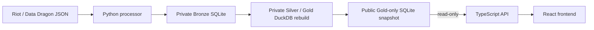

# Champion.GG Revitalization

League of Legends statistics with separate Riot and demo cohorts. Python owns
external JSON ingestion, transformation, and publication. TypeScript serves the
API and React frontend using only a read-only Gold SQLite snapshot.

The [architecture wiki](docs/wiki/README.md) documents service ownership,
publication, API behavior, operations, and change guidance. Future agent runs
start with [AGENTS.md](AGENTS.md) and the
[architecture skill](.agents/skills/championgg-architecture/SKILL.md).



| Store | Location | Access |
|---|---|---|
| Bronze and processing control | `data/champions.db` / `CHAMPIONGG_DB` | Python only |
| Silver and rebuild reports | Private `data/analytics/<run_id>/` | Python only |
| Published Gold | `data/gold/` / `CHAMPIONGG_GOLD_DIR` | Python writes; API reads |

See the [interactive schema](docs/database-snowflake-schema.html),
[SVG](docs/database-snowflake-schema.svg), [schema reference](docs/database-snowflake-schema.md),
[Gold ERD](docs/gold-physical-data-model.mmd), and
[Gold Lucidchart import](docs/gold-data-model-lucidchart.tsv).

## Local quick start

Use Python 3.12 and Node 24, and activate your Python environment first. On
PowerShell systems that block `npm.ps1`, use `npm.cmd` instead of `npm`.

```powershell
python -m pip install -r requirements.txt
npm ci
python -m processor.main setup
python -m processor.main seed
npm run build
npm run start
# http://localhost:8000
```

`setup` provisions the DuckDB SQLite extension once; rebuilds never download
extensions. `seed` downloads a small static catalog and generates demo matches.
Offline runs retain cached static data or use bundled champion identities.
For development, run `npm run dev:server` and `npm run dev:client` in separate
terminals. Vite on port 5173 proxies `/api` to port 8000.

## Containers and configuration

```powershell
docker compose build processor api
docker compose run --rm processor seed
docker compose up -d api
```

The processor image includes its DuckDB extension. Python runs commands and exits;
there is no middleware or ingestion daemon. Refresh with `docker compose run --rm
processor fetch ...` or `aggregate`. Python receives private-data and writable
gold-data volumes. **The API receives only gold-data, mounted read-only**, and
no Riot credentials. Both images run as non-root users with read-only container
filesystems; API SQLite connections also use `readOnly: true`. Local processes
running as your own user do not have this container mount boundary.

Compose uses fresh named volumes, not local `data/` files. To reuse local data,
replace the processor's private-data mount with your private directory and rebuild
Gold before starting the API. Never mount private storage into the API. Existing
private files are preserved; no destructive migration is needed.

[.env.example](.env.example) documents settings. Compose reads `.env`; local Python
and Node commands use environment variables and do not automatically load it.
Relative `CHAMPIONGG_GOLD_DIR` paths resolve against the repository root in both services.
Set `CHAMPIONGG_PORT` to change Compose's host port (default `127.0.0.1:8000`).

## Ingestion and publication

Get a development key from https://developer.riotgames.com, then:

```powershell
$env:RIOT_API_KEY = "RGAPI-..."
python -m processor.main fetch --max 500 --platform na1 --region americas
```

The fetcher paces Riot requests and records exact payloads, observation history,
and partial-run errors. It collects matches, timelines, static definitions,
ranked ladders, and player/reference datasets. See the [Bronze catalog](docs/bronze-layer.md).

| Command (`python -m processor.main ...`) | Behavior |
|---|---|
| `setup` | Provision the DuckDB SQLite extension |
| `seed [--matches N]` | Refresh demo static data, seed matches, rebuild and publish |
| `fetch [--max N]` | Ingest Riot data, rebuild and publish |
| `sync-static` | Refresh static/reference data, rebuild and publish |
| `aggregate` | Validate Silver and publish Gold from existing private inputs |
| `purge-demo` | Remove private demo rows, rebuild and publish |
| `status` | Show ingestion counts and the public manifest |

Python creates a fresh SQLite database using an explicit Gold allowlist: statistics,
champion identities, rune metadata, source counts, and public metadata. Raw payloads,
player identities, and private paths are excluded. Completed snapshots use rollback
journaling and need no WAL/SHM sidecars. Python atomically switches `current.json`
after validation; it records the filename, schema version, run ID, and publication
time. Publications are serialized and retain the current and previous snapshots.
Cleanup of open older files is deferred.

The API validates replacements between requests and keeps each request on one
snapshot. Failed builds leave the old publication available. A failed replacement
load retains the API's last valid snapshot and logs the error. Without a valid
first snapshot, data endpoints return JSON `503`; the frontend still loads.

Python upgrades existing private databases. Legacy unprefixed aggregates remain
for compatibility but are no longer refreshed or served. The older
[Silver plan](docs/silver-layer-plan.md), [proposed import](docs/silver-data-model-lucidchart.tsv),
and [proposed ERD](docs/silver-core-proposed.mmd) remain historical references.

## API

| Endpoint | Description |
|---|---|
| `GET /api/meta?source=riot` | Sources, patches, counts, static version, publication metadata |
| `GET /api/champions?source=riot&patch=16.17` | Champion/role statistics |
| `GET /api/champion/:key?source=riot&patch=16.17` | Detail, matchups, builds, spells, runes |
| `GET /api/search?q=ahri` | Source-independent name/key search |
| `GET /api/static/runes?version=16.17.1` | Published English rune catalog; missing versions return empty styles |

Omitted source defaults to eligible Riot data, then demo, then `null` if neither
exists. Invalid sources return `400`; valid sources without data yield empty
statistics. Omitted patch uses the selected source's latest patch. Unknown champions
return `404`; unexpected server errors return JSON `500`. The source selector
never mixes cohorts and changes the patch only when necessary. Images remain CDN
URLs; all browser JSON requests use the local API.

## Tests

```powershell
python -m unittest discover -s processor -t .
npm run test:server
npm run test:client
npm run build
python scripts/test_containers.py
python docs/render_database_schema.py
```

Endpoint tests use real HTTP and temporary SQLite databases published by Python.
They require no credentials or upstream requests and never open the working database.
Set `PYTHON` if the interpreter is not in `.venv` or on PATH. Browser tests use
installed Edge on Windows; elsewhere first run `npx playwright install chromium`.
Set `PLAYWRIGHT_CHANNEL` to select another installed browser. Browser tests use
local API fixtures and block external assets.

Container checks require Docker with Compose. They build both images using a
unique disposable project, verify endpoints and storage isolation, then remove
only that project's containers and generated volumes.

Skill-order, rank analysis, and recommendation features remain future work.
Not affiliated with Riot Games.
