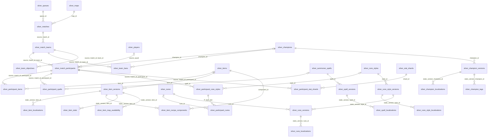
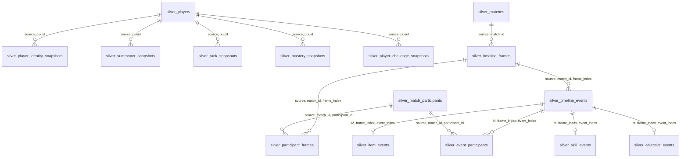
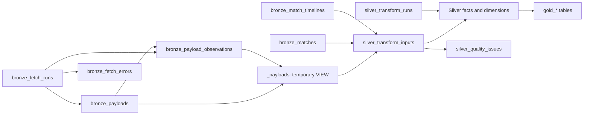

# Database snowflake schema

Open the [interactive visual schema](database-snowflake-schema.html) in a browser
to search, zoom, and inspect tables and views, or use the
[standalone SVG diagram](database-snowflake-schema.svg). Both work offline.
Regenerate these files with `python docs/render_database_schema.py` after updating
database definitions or diagram layout.

This is the schema reference for the database definitions currently in the
repository. It arranges match facts and their normalized dimensions as a
snowflake, with Bronze provenance and Gold serving tables documented alongside
them. All names below refer to implemented definitions; this document does not
introduce new database objects.

## Storage and sources of truth

| Store | Contents | Definition |
|---|---|---|
| SQLite: `data/champions.db`, or `CHAMPIONGG_DB` | Bronze, control tables, champion cache, original aggregates | [processor/db.py](../processor/db.py) |
| DuckDB: `<database directory>/analytics/<run_id>/analytics.duckdb` by default | Silver tables and Gold tables created during a rebuild | [processor/silver_models.py](../processor/silver_models.py), [processor/staging.py](../processor/staging.py), [processor/sql/v1/gold.sql](../processor/sql/v1/gold.sql) |
| SQLite: `data/gold/gold-<run_id>.sqlite`, or `CHAMPIONGG_GOLD_DIR` | Public `gold_*` tables, published as complete snapshots | [processor/gold.py](../processor/gold.py) |
| TypeScript API | Reads only the public Gold snapshot, using a read-only connection and container mount | [webapp/server/src/db.ts](../webapp/server/src/db.ts) |

Python rebuilds Bronze into a private DuckDB Silver/Gold snapshot, validates it,
then creates a fresh public SQLite database containing only the Gold allowlist.
`current.json` identifies its snapshot filename, schema version, run ID, and
publication time. Completed snapshot files never change; the manifest switches
atomically and the API adopts it between requests. The current and previous
publications are retained. Publication failure leaves the previous data available.
The API returns 503 until a valid first publication exists.

Bronze, Silver, control tables, raw player identities, and analytics paths are
never copied into the public database. SQLite uses file-level isolation here,
not SQL accounts or schema grants. In Compose only Python sees private storage;
the API's Gold mount is read-only. Legacy private aggregate tables may still
exist for compatibility but are no longer refreshed or served.

The older [Silver plan](silver-layer-plan.md) and [proposed ERD](silver-core-proposed.mmd)
remain historical proposals; this reference describes the implemented definitions.

## Reading the snowflake

The central fact is `silver_match_participants`: one participant in one match.
Match/team, player, and champion dimensions branch outward; champion, item,
spell, and rune definitions branch again into versions and localized text.
Inventory, rune selections, team results, and timeline observations have their
own grains, so they are separate child facts or bridges.

Diagrams show logical join paths, including paths that are not declared foreign
keys. Silver tables use `CREATE TABLE AS SELECT`; their registry keys and
registered references are checked by `rebuild.validate`, rather than enforced by
database PK/FK constraints. Extra descriptive joins, such as identity to static
version, are logical only. SQLite enforces the Bronze foreign keys listed below
when `PRAGMA foreign_keys=ON`; neither aggregate family declares foreign keys.

Key abbreviations used in the inventory:

- **M** = `(source, match_id)`; **T** = `(source, match_id, team_id)`.
- **P** = `(source, match_id, participant_id)`.
- **F** = `(source, match_id, frame_index)`; **E** = `(F, event_index)`.
- **U** = `(source, puuid)`; **O** = `(source, puuid, observation_id)`.
- **V** = `static_version`; **G** = `(source, patch, champion_id, role)`.

Keep `source` in every match/player join: Riot and demo identities are separate.
`patch`, `normalized_role`, `platform`, and `locale` are attributes, not standalone
dimension tables in the current schema.

### Match facts and dimensions



| Silver table | Grain / registry key | Attributes and join notes |
|---|---|---|
| `silver_matches` | M | Queue, map, platform, game version, patch, mode/type, UTC start/end, original duration and normalized seconds |
| `silver_match_teams` | T | Match team and win result |
| `silver_match_participants` | P | Team, nullable PUUID, champion, source position labels, normalized role, win, level, K/D/A, gold, CS, damage, vision, surrender flags |
| `silver_participant_items` | `(P, slot)` | Final inventory; slots 0–6, including trinket; explicit empty slot has null `item_id` |
| `silver_participant_spells` | `(P, slot)` | Slots 1–2 and nullable `spell_id` |
| `silver_participant_rune_styles` | `(P, style_slot)` | `style_id`, primary/secondary designation |
| `silver_participant_runes` | `(P, style_slot, selection_slot)` | `rune_id`, `var1`, `var2`, `var3`; joins the complete selected-style key |
| `silver_participant_stat_shards` | `(P, shard_slot)` | Offense/flex/defense slot and `shard_id` |
| `silver_team_bans` | `(T, pick_turn)` | Original champion ID plus nullable normalized ban ID |
| `silver_team_objectives` | `(T, objective_type)` | Objective count and first-objective flag |

### Static dimensions and version resolution

| Silver table | Grain / registry key | Attributes and join notes |
|---|---|---|
| `silver_champions` | `champion_id` | Identity only; may lack a retained definition |
| `silver_items` | `item_id` | Identity only, including referenced recipe/event items |
| `silver_summoner_spells` | `spell_id` | Identity only |
| `silver_runes` | `rune_id` | Identity only |
| `silver_rune_styles` | `style_id` | Identity only |
| `silver_stat_shards` | `shard_id` | Identity only |
| `silver_queues` | `queue_id` | Reference name, or an identity from matches without a description |
| `silver_maps` | `map_id` | Reference name, or an identity from matches without a description |
| `silver_static_versions` | V | Retained champion/item/spell/rune definition versions |
| `silver_game_version_static_mappings` | `(game_version, platform)` | Nullable V, `resolution_method`, `mapping_revision` |
| `silver_champion_versions` | `(V, champion_id)` | Data Dragon key, resource type, typed base/growth statistics |
| `silver_champion_localizations` | `(V, champion_id, locale)` | Name, title, description |
| `silver_champion_tags` | `(V, champion_id, tag)` | Champion class membership |
| `silver_item_versions` | `(V, item_id)` | Total/base/sell gold and purchasable flag |
| `silver_item_localizations` | `(V, item_id, locale)` | Name and description |
| `silver_item_recipe_components` | `(V, item_id, component_slot)` | `component_id` references item identity; preserve repeated components by slot |
| `silver_item_stats` | `(V, item_id, stat_name)` | Numeric `value` |
| `silver_item_map_availability` | `(V, item_id, map_id)` | Boolean `value`; map key is source text, so normalize its type before a map-identity join |
| `silver_spell_versions` | `(V, spell_id)` | Key, summoner level, maximum rank |
| `silver_spell_localizations` | `(V, spell_id, locale)` | Name and description |
| `silver_rune_style_versions` | `(V, style_id)` | Style key and `icon_path` |
| `silver_rune_style_localizations` | `(V, style_id, locale)` | Style name |
| `silver_rune_versions` | `(V, rune_id)` | Rune key, `icon_path`, `style_id`, tree slot |
| `silver_rune_localizations` | `(V, rune_id, locale)` | Name, long and short descriptions |

Resolve historical definitions through
`silver_matches.(game_version, platform)` →
`silver_game_version_static_mappings.(game_version, platform)` →
`silver_static_versions.static_version`, then join the relevant version table on
**both** V and the identity ID. Select a locale when joining localized text to
avoid multiplying fact rows. The current mapping chooses the highest retained
Data Dragon build within the same major/minor patch and marks it
`approximate_same_patch`; no match yields `unavailable` and a null V. It does not
claim an exact historical mapping. Identity rows can exist without version rows.

### Player history and timeline facts



| Silver table | Grain / registry key | Attributes and join notes |
|---|---|---|
| `silver_players` | U | Observed nonempty PUUIDs; display names live in snapshots |
| `silver_player_identity_snapshots` | O | Observation UTC time, game name, tag line |
| `silver_summoner_snapshots` | O | Observation UTC time, platform, summoner/account IDs, level, profile icon |
| `silver_rank_snapshots` | `(O, queue_type)` | Platform, observation UTC time, tier, division, LP, wins/losses |
| `silver_mastery_snapshots` | `(O, champion_id)` | Platform, observation UTC time, mastery level/points, last-played milliseconds |
| `silver_player_challenge_snapshots` | `(O, challenge_id)` | Platform, observation UTC time, value, level, percentile, achievement milliseconds |
| `silver_timeline_frames` | F | Match-relative `timestamp_ms`; zero-based frame index |
| `silver_participant_frames` | `(P, frame_index)` | Gold, XP, level, CS, position, damage, health, armor, attack damage, ability power |
| `silver_timeline_events` | E | Event type, time, position, original actor/killer/victim IDs |
| `silver_item_events` | E | Item and before/after IDs for purchase/sale/undo/destruction |
| `silver_skill_events` | E | Skill slot and level-up type |
| `silver_objective_events` | E | Team/killer-team, monster/building/tower/lane attributes |
| `silver_event_participants` | `(E, participant_id, relationship)` | Actor/killer/victim/assistant bridge; joins P and E |

Snapshot `observation_id` links logically to the originating SQLite
`bronze_payload_observations` row; it is not a cross-database FK. Repeated fetches
of the same body retain separate observations. Rank at observation time is not
automatically rank at match time. Event identity uses array ordinals, not time;
several events can share a timestamp.

## Bronze, lineage, and control tables



Arrows in this diagram indicate provenance/dependency, rather than cardinality
or an enforced foreign key.

| Table | Store / key | Contract |
|---|---|---|
| `bronze_fetch_runs` | SQLite / PK `run_id` | Pipeline, JSON parameters, start/end UTC, status, error |
| `bronze_payloads` | SQLite / PK `payload_id` | Nullable FK `fetch_run_id` → `bronze_fetch_runs.run_id`; source, dataset, routing, natural key, URL/params, exact response JSON, SHA-256, fetch UTC |
| `bronze_payload_observations` | SQLite / PK `observation_id` | Required FK `payload_id` → payloads; nullable FK `fetch_run_id` → fetch runs; observation UTC and origin (`fetch` or `legacy`) |
| `bronze_fetch_errors` | SQLite / PK `error_id` | Required FK `fetch_run_id` → fetch runs; dataset, natural key, error, occurrence UTC |
| `bronze_matches` | SQLite / PK `match_id` | Exact match JSON, source, fetch UTC |
| `bronze_match_timelines` | SQLite / PK `match_id` | Exact timeline JSON, source, fetch UTC; logical match join only |
| `raw_matches` | SQLite / PK `match_id` | Legacy match landing table; initialization copies missing rows into `bronze_matches` |
| `meta` | SQLite / PK `key` | Private text `value`; Data Dragon version and retained legacy processing metadata |
| `schema_migrations` | SQLite / PK `version` | Migration application UTC; initialization currently records version 1 |
| `rebuild_runs` | SQLite / PK `run_id` | Start/end UTC, status, snapshot path, JSON report, error |
| `silver_transform_inputs` | DuckDB / logical key `input_id` | Source table/source/dataset, natural key, routing, nullable payload ID, content hash, observation UTC |
| `silver_transform_runs` | DuckDB / logical key `run_id` | One row per snapshot: transform version and validation status |
| `silver_quality_issues` | DuckDB / no declared key | Severity, nullable `input_id`, source path, rule, detail; multiple issues per input |

Bronze payload uniqueness is
`(source, dataset, routing_value, natural_key, content_sha256)`. Indexes are
`idx_bronze_payloads_lookup` on `(dataset, routing_value, natural_key, fetched_at DESC)`,
`idx_bronze_payloads_run` on `fetch_run_id`, and
`idx_bronze_observation_payload` on `(payload_id, observed_at)`.
`idx_bronze_legacy_observation` uniquely indexes `payload_id` only where
`origin='legacy'`.

Silver rows with `input_id` and `transform_run_id` carry logical lineage to
`silver_transform_inputs.input_id` and `silver_transform_runs.run_id`. Derived
identity/bridge tables do not all carry these columns; see the model registry
for each table's exact columns and transformation expressions. The three Silver
control tables above are created outside the registry and have no physical
PK/FK constraints. Input IDs use `payload:<id>`, `match:<source>:<match_id>`, or
`timeline:<source>:<match_id>`.

## Gold and original serving aggregates

Gold tables are materialized in private DuckDB, then copied into a fresh public
SQLite snapshot in one transaction. The manifest switch commits publication. Gold registry keys below become physical composite
primary keys in the separate Gold SQLite file; DuckDB validates their uniqueness during the rebuild.

| Gold table | Key / grain | Measures or attributes; input |
|---|---|---|
| `gold_patch_totals` | `(source, patch)` | Eligible match count; `silver_matches` |
| `gold_champion_stats` | G | Games, wins, kills, deaths, assists, gold, damage, CS totals; eligible participants |
| `gold_champion_bans` | `(source, patch, champion_id)` | Ban count; `silver_team_bans` and eligible matches |
| `gold_matchups` | `(G, opponent_id)` | Games/wins; opposing-team participants in the same normalized role |
| `gold_builds` | `(G, items)` | Games/wins; JSON sorted combination of up to three eligible final inventory items |
| `gold_spell_sets` | `(G, spells)` | Games/wins; JSON sorted spell IDs from participant spell slots |
| `gold_rune_sets` | `(G, keystone, sub_style)` | Games/wins; primary rune selection and secondary style |
| `gold_champions` | `champion_id` | Key, name, title, JSON tags; retained static definitions with private `champions` cache fallback |
| `gold_source_counts` | `source` | Bronze match counts for Riot/demo, without raw payloads |
| `gold_rune_catalog` | `(version, locale)` | JSON typed style/slot/rune catalog, names and icon paths; latest observed static definitions |
| `gold_meta` | `key` | Public `ddragon_version`, `aggregated_at`, `run_id`, `schema_version` only |

All Gold match cohorts require queue 420 and at least 300 seconds. Participant
aggregates also require a recognized normalized role and positive champion ID.
Ban counts use eligible matches without the participant-role filter. Matchups
choose the last participant ID for each opposing team/role and exclude identical
champion pairs. Builds describe final inventory combinations, not purchase order.

Join Gold aggregates to `gold_patch_totals` on `(source, patch)` and to
`gold_champions` on `champion_id`; `opponent_id` also refers to champion identity.
Rune IDs can join Silver identities for analysis. JSON item/spell arrays require
expansion before identity joins. These are logical relationships, with no
declared aggregate foreign keys. `gold_champions` is a display snapshot, not a
historical static-version dimension.

These original tables remain in private SQLite for compatibility. The API never reads them:

| Original table | Physical primary key | Contents |
|---|---|---|
| `champions` | `champion_id` | Current champion key, name, title, JSON tags cache |
| `patch_totals` | `patch` | Match count |
| `champion_stats` | `(patch, champion_id, role)` | Games/wins and K/D/A/gold/damage/CS totals |
| `champion_bans` | `(patch, champion_id)` | Ban count |
| `matchups` | `(patch, champion_id, role, opponent_id)` | Games/wins |
| `builds` | `(patch, champion_id, role, items)` | JSON item combination and games/wins |
| `spell_sets` | `(patch, champion_id, role, spells)` | JSON spell combination and games/wins |
| `rune_sets` | `(patch, champion_id, role, keystone, sub_style)` | Games/wins |

The original aggregate keys omit `source`. Their patch/champion relationships
are logical joins, not foreign keys. API win/pick/ban rates and averages are
computed by application queries/code; they are not database views.

## Views

| View | Engine / lifetime | Grain and dependencies | Consumers |
|---|---|---|---|
| `_payloads` | DuckDB / temporary, rebuild connection only | One row per `bronze_payloads.payload_id`; left join latest observation per payload from `bronze_payload_observations` | `silver_transform_inputs`, observation staging, match/timeline candidates, static/player/reference staging |

There are currently no application-defined persistent views or materialized
views. `_payloads` is the only view definition in the processor. Temporary
objects such as `_eligible_matches`, `_eligible_players`, `_observations`, and
`_run` are tables. The temporary view disappears when the rebuild connection
closes; it is absent from published SQLite and reopened DuckDB snapshots.

Definition from [processor/staging.py](../processor/staging.py):

```sql
CREATE TEMP VIEW _payloads AS
SELECT p.*, 'payload:' || p.payload_id AS input_id,
    try_cast(p.response_json AS JSON) AS body,
    coalesce(o.observed_at, try_cast(p.fetched_at AS TIMESTAMPTZ)) AS observed_at,
    split_part(p.natural_key, ':', 2) AS locale,
    p.routing_value AS version
FROM bronze_payloads p
LEFT JOIN (
    SELECT payload_id,
        max(try_cast(observed_at AS TIMESTAMPTZ)) AS observed_at
    FROM bronze_payload_observations
    GROUP BY payload_id
) o USING (payload_id);
```

The output contains every Bronze payload column plus text `input_id`, parsed
JSON `body`, UTC `observed_at`, text `locale`, and text `version`. Invalid JSON
parses to null. `observed_at` falls back to the payload fetch time when no valid
observation exists. This view preserves all payload versions; choosing one match
or static definition happens in downstream staging/model SQL.

## Maintenance

Update this reference whenever database definitions change, including temporary
and persistent views. Check the SQL in `db.py`, the Silver registry, staging,
Gold SQL, publication logic, and API reads. Keep grains and complete compound
join keys accurate, distinguish enforced constraints from logical relationships,
and record view columns, definitions, dependencies, and lifetime. Reflect changes
in the relevant diagrams and other affected schema exports under `docs/`.

## Gold API contract and imports

All statistics are scoped by `source` (`riot` or `demo`) and patch. The API
never combines cohorts. The default source is Riot when eligible data exists,
otherwise demo. The source selector refreshes metadata and statistics together.
`/api/meta` reads source counts from `gold_source_counts`, not Bronze, and exposes
publication run/schema metadata. `/api/static/runes` reads `gold_rune_catalog`
for an exact Data Dragon version and `en_US`; an absent catalog yields empty styles.

Rune/style version models now retain `icon_path` alongside their identity fields.
The typed `_static_styles` staging records preserve the ordered slot/rune arrays
used to build the Gold catalog. Optional JSON fields remain NULL; incompatible
provided values are recorded as quality issues and block publication.

The [Gold ERD](gold-physical-data-model.mmd) and [Gold import table](gold-data-model-lucidchart.tsv)
are generated from the published SQLite schema by the visual-schema renderer.
The TSV uses SQL Server import formatting for Lucidchart only; the database is SQLite.
The existing champion physical model describes private SQLite, including legacy tables.
