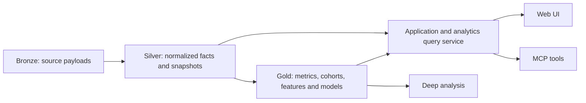

# Silver layer: critique and proposed data model

Status: historical design proposal. The normalized rebuild and separate Gold
publication are now implemented; use [the current schema reference](database-snowflake-schema.md)
for the actual schema and storage boundary. Findings below describe the earlier implementation.

## Long-term goal

Build a League of Legends data platform with three connected products:

1. A web application that displays statistics through complex, interactive views,
   including champion, matchup, build, player, and progression analysis.
2. An analytics database for deep analysis, reproducible metrics, and statistical
   or predictive modeling.
3. An MCP interface that exposes those analytics and statistics to assistants,
   helping people decide who to pick, identify ways to improve, and explore other
   League of Legends questions with supporting evidence.

All three should share definitions, data provenance, and freshness information.

## Critique before implementation

The Bronze / Silver / Gold direction is appropriate. The main adjustment is to
define Silver as reusable, normalized observations, rather than everything the
application directly queries. Complex screens need fast, purpose-built summaries;
forcing them to join every normalized table would couple UI performance to the
analytical schema. Serve detail from Silver-backed endpoints and summaries from
Gold-backed endpoints through one application/query service.

Gold should contain both analytical models and application-serving aggregates.
Gold is not limited to machine learning. Layer boundaries are logical contracts;
they do not initially require three database servers. Keep SQLite for the first
implementation and decide on a separate analytics engine from measured volume,
concurrency, and query latency, especially once timelines grow.

Normalize data needed for defined questions, not every Bronze endpoint immediately.
Match, static reference, player history, and timeline data support the stated
products. Platform status, Clash, and rotation can remain in Bronze until a product
feature needs them. Preserve unknown source fields in Bronze rather than making
Silver an untyped key/value copy of the API.

Recommendation quality needs more than win rates. A high item win rate does not
establish that buying the item caused the win; game length and player strength
can affect both. Advice should carry its cohort, sample size, uncertainty,
freshness, and limitations. Personal improvement requires longitudinal player
and timeline data; champion aggregates alone cannot support it.

## Findings in the current repository

These are observations of local code, not claims about a future implementation:

| Current behavior | Design implication |
|---|---|
| `processor/aggregate.py` reads `bronze_matches` directly | Introduce normalized facts between ingestion and aggregation |
| Only queue 420, games at least 300 seconds, and recognized roles contribute to various aggregates | Keep observations in Silver; define eligibility and exclusions explicitly in Gold |
| `core_items()` takes up to three final inventory items, then aggregation sorts them | This is a final-inventory combination, not purchase order or confirmed first three completed items |
| Rune aggregates retain keystone and secondary style only | Preserve every rune selection, style, slot, and stat shard in Silver |
| Matchups use matching role labels on opposite teams | Treat lane-opponent pairing as a derived interpretation, not a source relationship |
| Current aggregates omit source from their keys and consume demo and Riot rows | Separate demo and real cohorts before publishing statistics |
| `champions` is a current identity/display cache | Add historical static versions for patch-dependent interpretation |
| Bronze payloads deduplicate identical bodies | A payload timestamp alone does not represent every later observation of unchanged rank/mastery |

The existing aggregate tables are **Gold-like serving tables**, despite older
documentation calling them Silver. The existing physical ERD describes the
current database, not this proposal.

## Layer and access contracts

- **Bronze:** exact source bodies, request identity, ingestion errors, and versions.
- **Silver:** typed values, stable keys, normalized repeated structures, consistent
  units, source observations, quality flags, and lineage. No minimum sample or
  champion recommendation policy.
- **Gold:** cohort eligibility, rank buckets, matchup interpretation, item build
  reconstruction, rates, confidence estimates, benchmarks, feature datasets, and
  model outputs. Each output has a definition/version and refresh metadata.
- **Query service / MCP:** bounded, parameterized queries using the same metric
  definitions as the UI. Results include filters, sample counts, coverage and
  freshness. Separate aggregate access from player identity access; avoid making
  raw player identifiers a default public result.

## Silver conventions

- Prefix physical tables with `silver_`; names below omit this prefix for clarity.
- Natural compound keys document the grain. A surrogate key may be added later,
  but must not replace the corresponding uniqueness constraint.
- Match identity is `(source, match_id)` so demo and Riot namespaces cannot collide.
  Every match child includes both columns, abbreviated **M** below.
- Participant identity is `(M, participant_id)`, abbreviated **P**. Participant
  IDs are local to a match, never global player IDs.
- Player identity is PUUID where supplied; display names are mutable attributes.
  Missing player identity remains null, with the participant row retained.
- Store event time separately from observation and transformation time. Use UTC
  timestamps, duration seconds, timeline offsets in milliseconds, and explicit
  units in column names.
- Keep full `game_version` as well as parsed patch major/minor. Record static
  version resolution explicitly; do not silently use today's item definitions.
- Preserve source role labels alongside a nullable normalized role. Unknown is
  distinct from invalid and from zero. No inferred lane opponent FK in Silver.
- Reference identities can exist without descriptions. Unknown historical items
  must not cause valid match facts to disappear.
- Normalize arrays when order, membership, or joins matter. Fixed scalar measures
  such as kills and gold belong in typed columns, not a universal metric/value table.

## Proposed entities and keys

This is a logical schema with representative attributes, not final DDL. All child
FKs use the full compound parent key. Import the accompanying
[SQL Server metadata output](silver-data-model-lucidchart.tsv) into Lucidchart.
The [Mermaid core ERD](silver-core-proposed.mmd) is an additional text visualization.

### Page 1: match facts — first implementation

| Entity | Grain / primary key | Important attributes and relationships |
|---|---|---|
| `matches` | M | queue ID, map ID, platform, full game version, patch, start/end UTC, duration seconds, game mode/type, source payload hash, timeline availability |
| `match_teams` | `(M, team_id)` | FK matches; source win result |
| `match_participants` | P | FK `(M, team_id)`; nullable player PUUID; champion ID; source position/lane/role; normalized role; source win result; champion level; kills/deaths/assists; gold earned/spent; lane/neutral CS; champion damage; vision score; available surrender flags |
| `participant_items` | `(P, slot)` | FK participant; nullable item ID for an explicitly empty slot; retain final inventory slots including trinket |
| `participant_spells` | `(P, slot)` | FK participant and summoner spell identity |
| `participant_rune_styles` | `(P, style_slot)` | Primary/secondary designation and style ID |
| `participant_runes` | `(P, style_slot, selection_slot)` | FK selected style; rune ID; source selection variables |
| `participant_stat_shards` | `(P, shard_slot)` | FK participant; shard ID; keep separate from rune-tree selections |
| `team_bans` | `(M, team_id, pick_turn)` | FK team; nullable champion for an explicitly empty ban; preserve source sentinel separately if necessary |
| `team_objectives` | `(M, team_id, objective_type)` | FK team; source count and first-objective flag |

Do not assume every queue has ten participants or the standard five roles.
Apply queue-specific checks without dropping unsupported modes from Bronze.
Missing item/rune arrays must remain distinguishable from observed empty slots.

### Page 2: identities and static definitions

| Entity | Grain / primary key | Important attributes and relationships |
|---|---|---|
| `players` | PUUID | Stable identity only; populated from observed participants or player sources |
| `champions`, `items`, `summoner_spells`, `runes`, `rune_styles`, `stat_shards` | Source numeric ID, one table per kind | Stable identities; retain retired IDs |
| `queues`, `maps` | Source numeric ID | Reference definitions and availability |
| `static_versions` | Data Dragon version | Source lineage and publication metadata when supplied |
| `champion_versions`, `item_versions`, `spell_versions`, `rune_versions` | `(static_version, entity_id)` | Version-dependent attributes, separate table per kind |
| `entity_localizations` | `(entity_kind, static_version, entity_id, locale)` logical key | Names and descriptions; physical implementation should use per-kind tables for enforceable FKs |
| `champion_tags`, `item_recipe_components` | Version + entity + tag/component position | Repeated memberships and recipe quantities |
| `game_version_static_mappings` | `(game_version, platform)` | Nullable selected static version, resolution method, mapping revision; unavailable is explicit |

Add champion ability definitions by version and ability slot when ability detail
becomes a supported screen. Keep static version distinct from analytical patch
grouping: a major/minor patch label is not a complete static-resource key.

### Page 3: player observations — next phase

| Entity | Grain / primary key | Important attributes and relationships |
|---|---|---|
| `player_identity_snapshots` | `(PUUID, observation_id)` | Observed Riot ID/display attributes |
| `summoner_snapshots` | `(PUUID, platform, observation_id)` | Level, profile icon, source identifiers when supplied |
| `rank_snapshots` | `(PUUID, platform, queue_type, observation_id)` | Tier, division, LP, wins/losses; source dataset |
| `mastery_snapshots` | `(PUUID, platform, champion_id, observation_id)` | Mastery level/points and source last-played time |
| `player_challenge_snapshots` | `(PUUID, challenge_id, observation_id)` | Challenge value, level and percentile when available |

`observation_id` should reference a successful fetch occurrence with its timestamp,
even when the body repeats. Add a Bronze observation ledger linking each fetch
occurrence to the deduplicated payload before claiming complete snapshot history.
Existing history only supports the observations actually retained; do not invent
refresh timestamps or backfill fictional snapshots.

Rank snapshots describe rank when observed, not proven rank at match time. Gold
may use the nearest preceding observation under a documented maximum age, with
unknown and stale categories. Never attach a later rank to an earlier match as if
it were known then. Distinguish participant rank from an inferred match-level cohort.

### Page 4: timeline observations — next phase

| Entity | Grain / primary key | Important attributes and relationships |
|---|---|---|
| `timeline_frames` | `(M, frame_index)` | Source frame ordinal and timestamp_ms |
| `participant_frames` | `(P, frame_index)` | FK frame and participant; gold, XP, level, CS, position and supplied combat measures |
| `timeline_events` | `(M, frame_index, event_index)` | FK frame; source ordinal, event type, timestamp_ms, position when present |
| `event_participants` | `(event key, participant_id, relationship)` | FK event and participant; actor/victim/assistant relationships |
| `item_events` | Event key | FK event; item ID, before/after IDs where supplied; purchase/sale/undo/destroy subtype |
| `skill_events` | Event key | FK event; skill slot and level-up type |
| `objective_events` | Event key | FK event; objective subtype, team and other source fields |

Source array ordinals disambiguate events with identical timestamps. Replace a
match's timeline children atomically when its selected timeline version changes;
these ordinal keys are stable within a selected payload, not across arbitrary
source revisions. A missing timeline is not a game with zero events.

Purchase sequence, undo-aware inventory, skill order, gold differences at selected
minutes, and inferred opponent relationships are derived Gold models. Preserve
enough typed timeline facts to rebuild each interpretation.

### Page 5: lineage and quality

Use `transform_runs` for transform version, lifecycle and input selection;
`transform_inputs` for selected Bronze payload IDs or keyed source rows plus
content hashes; and `quality_issues` for entity key, rule, severity and disposition.
Each published Silver entity or match partition identifies the transform run and
input that produced it. Do not use a loose polymorphic lineage link as a substitute
for enforceable domain FKs.

For keyed demo/match inputs without a payload ID, retain source table, natural key,
content hash, and observation time. Canonical payload selection must be deterministic
and recorded; never combine a new match header with stale participant children.

## What Gold will own

| Product question | Silver foundation | Gold output |
|---|---|---|
| How strong is a champion in this role/cohort? | Matches, participants, rank observations | Cohort counts, win/pick/ban metrics, uncertainty |
| Who should I pick against this composition? | Participants, teams, champions, player history | Matchup/synergy features and evaluated recommendation model |
| Which build should I try? | Final inventory and item events | Separate inventory combinations and reconstructed purchase paths |
| Where can I improve? | Player matches, frames and events | Role/rank/patch benchmarks and longitudinal differences |
| How does performance change over patches? | Full game versions, historical references | Comparable patch cohorts and trend models |

Specify every denominator: champion appearances per eligible match, share of role
appearances, and percentage of matches containing a ban are different metrics.
Store numerator and denominator alongside rates. Report sampling scope: the current
ladder/player discovery pipeline is a collected sample, not proof of population
coverage. Track timeline/rank coverage separately from total match counts.

Keep model training features limited to information available at recommendation
time. End-of-game items, results, and future rank observations must not leak into
pre-game prediction features. Evaluate recommendations on held-out time periods;
do not present observational associations as guaranteed improvements.

## Build sequence and acceptance criteria

1. Review the core ERD and grains. Start with match/static normalization; preserve
   current endpoints while adding Silver alongside existing tables.
2. Implement transform runs, deterministic input selection, core tables, real FKs,
   and transactional replacement per match. Re-running identical inputs must not
   duplicate rows; changed payloads must remove obsolete children.
3. Backfill from retained Bronze. Validate parent/child integrity, duplicate keys,
   null-versus-zero handling, source separation, and queue-specific consistency.
   Record malformed inputs and counts rather than silently discarding them.
4. Rebuild current serving aggregates from Silver. Reconcile counts against the
   existing code for an equivalent cohort, and document intentional differences
   such as corrected build labels or missing-data handling.
5. Add observation history and player snapshots, then timeline frames/events.
   Test repeated identical snapshots, late timelines, source revisions, undo
   events, missing identity, and historical static gaps.
6. Version Gold metric definitions and expose them through shared query functions.
   Build MCP tools on those functions after the data contracts are established.

Indexes should start with participant PUUID + match lookup, match patch/queue/start
time, champion/role lookup, and timeline participant/time access. Measure actual
queries before adding broad indexes or selecting an analytics database.

## Lucidchart layout and decisions to revisit

Create separate ERD pages for the five domains above. Put matches, teams, and
participants at the center of the first page, with loadout children below. Mark
PKs/FKs and copy the full compound keys; connecting just `participant_id` would
incorrectly link participants across matches.

For database import, use [silver-data-model-lucidchart.tsv](silver-data-model-lucidchart.tsv).
It contains the SQL Server metadata query-result format, including the header,
column types, primary keys, and foreign-key target columns. It is generated from
the proposed core model, not exported from an implemented SQL Server database.
It includes minimal reference identities and transform-run metadata so all foreign
keys have target tables; later-phase snapshot, static-version, and timeline tables
are not included. SQL Server types and string lengths are proposed diagram types.

In Lucidchart, enable the Entity Relationship shape library, click **Import**, and
choose **SQL Server**. Proceed to the query-results step and upload the TSV, or paste
its complete contents. Drag imported tables onto the canvas to display their
relationships. No database query needs to be run for this prepared output. See
[Lucid's database import instructions](https://help.lucid.co/hc/en-us/articles/16471565238292-Create-an-Entity-Relationship-Diagram-in-Lucidchart).

The repeated metadata rows for columns that participate in both a primary key and
a foreign key are intentional. Preserve tabs and blank cells when copying.

Working assumptions: normalize all retained match queues, prioritize ranked solo
for the initial Gold product, retain historical observations, and implement the
match/static slice before player/timeline extensions. Revisit target regions,
history retention, expected traffic, analytics latency, and public versus personal
player features before choosing deployment/storage infrastructure. These decisions
do not block the logical core model.
