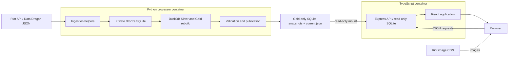

# Architecture and boundaries

[Wiki home](README.md)

Python owns the full path from external JSON to published statistics. TypeScript
owns HTTP responses and the user interface. Their data contract is a directory
of completed Gold SQLite snapshots, with a manifest identifying the current one.

## Ownership

| Component | Owns | Boundary |
|---|---|---|
| Python ingestion | Riot credentials, upstream requests, exact Bronze payloads, observation history, static downloads | Upstream JSON loading belongs here, including Data Dragon requests needed by the UI |
| Python transformation | Typed staging, Silver normalization, Gold aggregation, validation, publication | One canonical rebuild; no duplicate TypeScript ETL or alternate legacy publication path |
| TypeScript API | Snapshot adoption, queries over Gold, response formulas and formatting, HTTP errors, frontend hosting | Opens Gold read-only; has no private database, upstream data loader, migrations, or Riot credentials |
| React frontend | Source/patch state, local API requests, presentation, optional metadata fallbacks | Browser JSON comes from the local API; images may load directly from Riot's CDN |

The processor is command-driven and exits when a command completes. The API is
the long-running service. There is no required Python HTTP service, middleware,
database server, or additional ingestion daemon.

## Storage and access

| Store | Local default | Compose location | Readers and writers |
|---|---|---|---|
| Private SQLite | `data/champions.db` | `/data/private/champions.db` | Python reads and writes |
| Rebuild artifacts | `data/analytics/<run_id>/` | `/data/private/analytics/<run_id>/` | Python; private diagnostics only |
| Published Gold | `data/gold/` | `/data/gold/` | Python writes; TypeScript reads |

Rebuild artifacts default to an `analytics` directory beside the private database.
They include `analytics.duckdb`, `executed.sql`, and `report.json`; failed runs can
also leave intermediate artifacts. These files can contain identities, raw
inputs, and local paths and must remain private.

The Gold database is a **fresh file built from an explicit table and column
allowlist**. Copying or backing up the private SQLite file into the Gold directory
would expose private content and bypass this boundary. Legacy private aggregate
tables may still exist for compatibility; neither the publisher nor API uses
them as a fallback.

SQLite access here is enforced through separate files, connection flags, and
container mounts. There are no SQL login accounts or schema grants in this
deployment. The API uses `DatabaseSync(..., { readOnly: true })`; Compose mounts
only the Gold directory into it, with `:ro`. Riot credentials and the private
volume belong only to Python. Both containers run as non-root users with a
read-only root filesystem and a temporary `/tmp` mount.

These protections have distinct scopes: a local read-only connection prevents
writes through that connection, while the container mount also prevents ordinary
filesystem writes and omits private storage. Running both local processes as
your own user does not reproduce the container boundary. Compose does not impose
an outbound network firewall; external JSON loading is an application ownership
rule, not a claimed network restriction.

## Decisions to preserve

| Decision | Reason and consequence |
|---|---|
| One Python ingestion and publication owner | Data acquisition, lineage, normalization, and validation have one implementation |
| A separate Gold-only file | Public serving cannot accidentally query private Bronze, Silver, identities, or processing logs |
| Immutable snapshots plus an atomic manifest | The API sees completed data and can keep its last valid snapshot when a replacement fails |
| Source is part of aggregate keys and joins | Riot and synthetic demo statistics remain separate, including denominators and nested results |
| Static definitions are published by Python | API and browser JSON loading do not create a second upstream ingestion path |
| Single-host containers sharing Gold storage | The publication contract uses filesystem operations; distributed storage is a separate design change |

A request for a feature normally fits within these ownership rules. If the user
explicitly changes a boundary, update the implementation, wiki, skill, and tests
together; these decisions are not a reason to reject an authorized redesign.

## Implementation map

| Responsibility | Source |
|---|---|
| Commands and canonical rebuild entry | [main.py](../../processor/main.py), [aggregate.py](../../processor/aggregate.py) |
| Private storage and lineage | [db.py](../../processor/db.py), [fetch.py](../../processor/fetch.py), [riot_api.py](../../processor/riot_api.py) |
| Shared static ingestion and demo fallback | [ddragon.py](../../processor/ddragon.py), [seed_demo.py](../../processor/seed_demo.py) |
| Staging, models, validation | [staging.py](../../processor/staging.py), [silver_models.py](../../processor/silver_models.py), [rebuild.py](../../processor/rebuild.py) |
| Aggregate definitions and publication schema | [gold.sql](../../processor/sql/v1/gold.sql), [gold.py](../../processor/gold.py) |
| Snapshot adoption and serving queries | [snapshots.ts](../../webapp/server/src/snapshots.ts), [db.ts](../../webapp/server/src/db.ts) |
| Deployment boundary | [compose.yaml](../../compose.yaml), [processor image](../../processor/Dockerfile), [web image](../../webapp/Dockerfile) |
